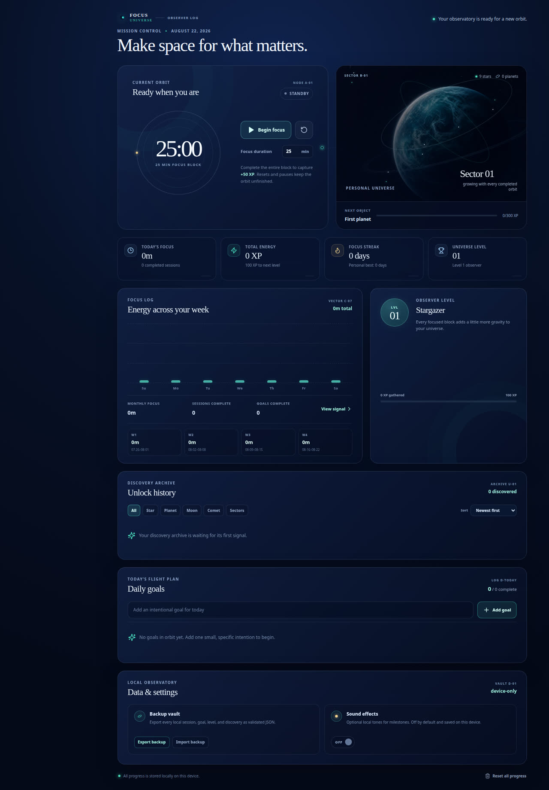
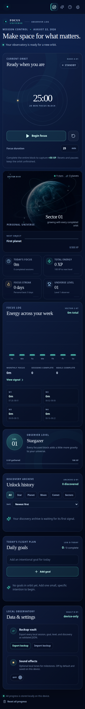

# Focus Universe

> A local-first focus companion that turns completed work into a growing personal universe.

Focus Universe is a cinematic productivity web app built around intentional focus sessions, daily goals, and visible long-term progression. It is designed to work entirely in the browser: users can track work, earn XP, grow a universe, review insights, and retain ownership of their data without creating an account.

## Live Demo

A hosted public demo is not configured in this repository. Run the project locally with the instructions below to explore the complete experience.

## What It Does

The app provides a focused 25-minute default timer, editable daily goals, and a personal progression system. Completing a full focus session or a goal awards XP; XP advances the observer level and expands the user’s universe with stars, planets, moons, comets, and sectors. Local analytics translate completed sessions into daily, weekly, and monthly focus totals.

## Main Features

| Area | Capabilities |
| --- | --- |
| Focus workflow | Start, pause, resume, reset, and customize a focus timer without awarding XP for incomplete sessions. |
| Goals | Create, edit, delete, and complete daily goals with idempotent XP awards. |
| Progression | Earn XP, advance levels, maintain streaks, and unlock cosmic objects at deterministic thresholds. |
| Universe | View a persistent universe with animated stars, planets, moons, comets, orbit motion, and unlock feedback. |
| Insights | Review daily, weekly, monthly, and four-week focus totals. |
| Unlock history | Browse, filter, and sort first-discovery records with their unlock dates. |
| Data controls | Export a validated JSON backup, import a validated backup after confirmation, and enable optional local sound effects. |
| Accessibility | Keyboard-focusable controls, readable labels, dismissible milestone feedback, and reduced-motion support. |

## Progression Model

Focus Universe keeps its progression rules deterministic and local.

| System | Rule |
| --- | --- |
| Focus session XP | A completed timer awards **50 XP** exactly once. Paused, reset, or incomplete sessions award **0 XP**. |
| Goal XP | A newly completed goal awards **20 XP** exactly once, even if its completion state is later toggled. |
| Observer level | Levels follow `floor(sqrt(XP / 100)) + 1`. |
| Stars | The universe begins with 9 stars and gains one additional star every 55 XP, capped at 42. |
| Planets | A planet unlocks every 300 XP, capped at 4. |
| Moons | Moons unlock from the existing observer-level thresholds. |
| Comet | A comet unlocks at a 3-day consecutive productive streak. |
| Sectors | Universe sectors advance from observer-level milestones. |

First-time object unlocks are recorded in Unlock History and are not announced again after a browser reload.

## Local-First and Offline Behavior

All productivity state—including sessions, goals, XP, levels, streaks, unlock history, sound preference, and discovery dates—is stored in the browser’s `localStorage`. The included service worker caches the app shell after a successful first visit, so the interface remains available offline.

> **No API, backend, authentication, database, cloud storage, or external service is required to use Focus Universe.**

## Backup Export and Import

The **Data & Settings** section provides a portable, validated JSON backup workflow.

| Action | Behavior |
| --- | --- |
| Export Backup | Downloads all local Focus Universe progress and discovery history as a validated JSON file. |
| Import Backup | Validates the selected JSON file, requests confirmation before replacement, and safely rejects malformed or incompatible content. |
| Sound Effects | An optional ON/OFF preference for local milestone tones. It defaults to OFF and persists in `localStorage`. |

## Tech Stack

- **React 19** and **TypeScript**
- **Vite** for development and production builds
- **Tailwind CSS 4** with custom CSS for the cinematic observatory design
- **Lucide React** icons
- **Vitest** with fake timers and the V8 coverage provider
- Browser **localStorage**, Web Audio, and Service Worker APIs

## Project Structure

```text
focus-universe/
├── client/
│   ├── public/                 # Manifest, service worker, small app configuration
│   └── src/
│       ├── components/         # Shared UI primitives and error handling
│       ├── contexts/           # Theme context
│       ├── lib/
│       │   ├── productivity.ts # Testable timer, progress, backup, and analytics domain logic
│       │   └── productivity.test.ts
│       ├── pages/
│       │   └── Home.tsx        # Focus Universe dashboard
│       └── index.css           # Observatory Nightfall visual system
├── server/                     # Static production-serving entry point
├── package.json
└── README.md
```

## Run Locally

**Prerequisites:** Node.js 22+ and pnpm (recommended). npm can also run the provided scripts.

```bash
git clone <your-repository-url>
cd focus-universe
pnpm install
pnpm dev
```

Open the local URL printed by Vite. To preview a production build:

```bash
pnpm build
pnpm start
```

## Available Commands

| Command | Purpose |
| --- | --- |
| `pnpm dev` | Start the Vite development server. |
| `pnpm test` | Run the deterministic Vitest suite. |
| `pnpm test:coverage` | Run tests and generate a local V8 coverage report. |
| `pnpm check` | Run the TypeScript type check without emitting files. |
| `pnpm build` | Produce the optimized production build. |
| `pnpm start` | Serve the built app locally. |
| `pnpm preview` | Preview the Vite production bundle. |
| `pnpm format` | Format project files with Prettier. |

## Testing

Focus Universe uses **Vitest** with deterministic data and fake timers. The current suite contains **26 passing tests** covering:

- Timer start, pause/resume, reset, and a simulated 25-minute completion without waiting in real time.
- Exact-once focus-session and goal XP behavior.
- XP, level, streak, localStorage persistence, and reset confirmation.
- Goal editing, deletion, completion toggling, and analytics calculations.
- Cosmic object thresholds, unlock persistence, and duplicate prevention.
- Unlock-history recording, filtering, sorting, backup export/import validation, confirmation behavior, sound preference persistence, and weekly aggregation.

Run the full quality gate:

```bash
pnpm test
pnpm check
pnpm build
```

Generate local coverage:

```bash
pnpm test:coverage
```

## Screenshots

The repository includes authentic captures from the running application in `docs/screenshots/`.

| Main dashboard | Mobile layout |
| --- | --- |
|  |  |

Additional screenshot slots are reserved for the **Focus Timer + Personal Universe**, **Unlock History**, **Daily Goals**, and **Data & Settings** flows. Place future captures in `docs/screenshots/` and update this table when new views are added.

## Privacy

All productivity data stays locally in the browser. No account or server is required, and no external API is used. Backup files are only downloaded to or selected from the user’s own device.

## Future Improvements

- Add a pre-import backup summary with session, goal, and discovery counts.
- Add optional local notification permissions for completed focus sessions.
- Add a concise goal-completion trend view alongside weekly focus totals.

## Contributing

Contributions are welcome. Please read [CONTRIBUTING.md](CONTRIBUTING.md) for setup, quality checks, contribution workflow, and pull request expectations.

## Author

**Shreyas**

---

Built with care by Shreyas.
